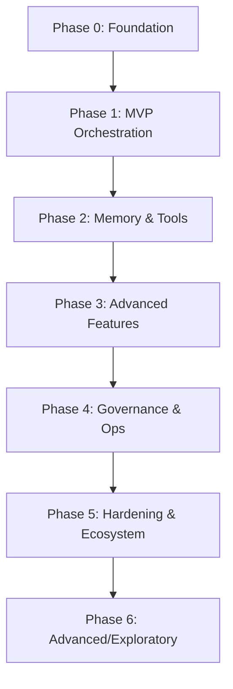

# AgentNet Documentation

Welcome to AgentNet, a policy-governed multi-agent LLM framework for dialogue, debate, tool-use, memory, and observability.

## Overview

AgentNet provides composable, inspectable primitives for building safe, transparent, and extensible multi-agent AI systems. Built around the **25 AI Fundamental Laws**, AgentNet ensures policy-first design, full observability, and systematic testing across all agent interactions.

## Key Features

### 🤖 **Multi-Agent Orchestration**
- Single and multi-agent reasoning with configurable dialogue modes
- Debate, critique-revise, round-robin, and async orchestration patterns
- Hierarchical agent structures with role-based capabilities

### 🛡️ **Policy-First Governance**
- Comprehensive policy engine with redaction, blocking, and transformation
- Role-based access control (RBAC) for tools and capabilities
- Compliance reporting and audit trail generation

### 🧠 **Memory & Context Management**
- Multi-layered memory: short-term, episodic, and semantic storage
- Vector store integration with retrieval and filtering
- Context-aware reasoning with memory persistence

### 🛠️ **Tool Integration**
- Extensible tool registry with plugin architecture
- Safe tool execution with policy compliance
- Performance monitoring and cost tracking

### 📊 **Observability & Performance**
- Comprehensive performance harness with latency tracking
- Token utilization analysis and optimization insights
- Real-time monitoring with dashboard and metrics

### 🧪 **Testing Framework**
- Systematic test matrix across configurations and features
- Integration testing combining multiple phases
- Performance regression testing with baseline management

## Quick Start

```python
from agentnet import AgentNet, ExampleEngine

# Create an agent
agent = AgentNet(
    name="MyAgent",
    style={"logic": 0.8, "creativity": 0.6, "analytical": 0.7},
    engine=ExampleEngine()
)

# Generate reasoning
result = agent.generate_reasoning_tree("How to optimize database performance?")
print(result['result']['content'])
```

## Architecture Overview

AgentNet is built in phases, each adding new capabilities while maintaining backward compatibility:



### Development Phases

- **Phase 0**: Core agent abstraction and basic reasoning
- **Phase 1**: Turn engine, policy framework, and event system
- **Phase 2**: Memory systems, tool integration, and critique loops
- **Phase 3**: DAG execution, advanced evaluation, and persistence
- **Phase 4**: Governance, RBAC, cost tracking, and compliance
- **Phase 5**: Performance harness, testing framework, and observability
- **Phase 6**: Streaming collaboration and advanced features

## Core Principles

AgentNet follows the **25 AI Fundamental Laws** for safe and transparent AI systems:

1. **Policy-first**: All reasoning and actions must pass through explicit policy gates
2. **Memory isolation**: Distinct layers for ephemeral, semantic, and structural knowledge
3. **Full observability**: Every non-trivial action emits a traceable event
4. **Deterministic surfaces**: Predictable input/output interfaces
5. **Explicit orchestration**: All agent sequences are logged and reproducible

[View all 25 laws →](reference/fundamental-laws.md)

## Getting Started

Choose your path:

<div class="grid cards" markdown>

-   :material-rocket-launch:{ .lg .middle } **Quick Start**

    ---

    Get up and running with AgentNet in minutes

    [:octicons-arrow-right-24: Installation guide](getting-started/installation.md)

-   :material-book-open-variant:{ .lg .middle } **User Guide**

    ---

    Learn core concepts and features step by step

    [:octicons-arrow-right-24: Core features](guide/core-features.md)

-   :material-code-braces:{ .lg .middle } **API Reference**

    ---

    Detailed API documentation and reference

    [:octicons-arrow-right-24: API docs](api/core.md)

-   :material-lightning-bolt:{ .lg .middle } **Examples**

    ---

    Working examples and use cases

    [:octicons-arrow-right-24: View examples](examples/basic.md)

</div>

## Latest Updates

!!! info "Phase 5 Release"
    
    **Performance Harness & Testing Framework** - Comprehensive benchmarking, latency tracking, token optimization, and systematic testing capabilities.

    - ✅ Performance harness with configurable benchmarks
    - ✅ Turn latency measurement and optimization insights
    - ✅ Token utilization tracking and cost analysis
    - ✅ Comprehensive test matrix and integration testing
    - ✅ Performance regression detection and reporting

## Community

- **GitHub**: [V1B3hR/agentnet](https://github.com/V1B3hR/agentnet)
- **Issues**: [Report bugs and request features](https://github.com/V1B3hR/agentnet/issues)
- **Discussions**: [Join the community discussion](https://github.com/V1B3hR/agentnet/discussions)

## License

AgentNet is released under the [GPL-3.0 License](https://github.com/V1B3hR/agentnet/blob/main/LICENSE).